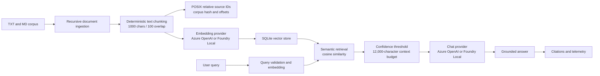

# Foundry RAG Cloud

[](https://ceren-azure-ai.streamlit.app)
[](https://github.com/omrumcerenguler/foundry-rag-cloud/actions/workflows/ci.yml)
[](https://www.python.org/)
[](https://streamlit.io/)
[](https://azure.microsoft.com/products/ai-services/openai-service)
[](tests/)
[](https://mypy.readthedocs.io/)
[](https://docs.astral.sh/ruff/)

## Live Demo

**[Open the deployed Streamlit application](https://ceren-azure-ai.streamlit.app)**

## English

### Executive Summary

Foundry RAG Cloud is a production-oriented, hybrid-deployment retrieval-augmented generation assistant. It provides a Streamlit experience backed either by Azure OpenAI or an offline Foundry Local runtime, with FastAPI available as a service boundary and SQLite as an embedded vector store.

The implementation focuses on grounded answers rather than unconstrained generation. Documents are recursively ingested, deterministically chunked, embedded, persisted with provenance, retrieved by cosine similarity, injected under a fixed context budget, and returned with source citations. If retrieval confidence is too low or the model does not cite a retrieved source, the service returns a safe fallback instead of presenting an unsupported answer.

This repository is a reference implementation for resilient RAG service design. It does not claim to provide Azure account-level financial enforcement in code: Azure TPM quotas and budget alerts must be configured separately in the Azure resource and subscription.

### Technology Stack

| Layer | Technology |
| --- | --- |
| Runtime | Python 3.13 in local CI and Docker; Python 3.11+ badge indicates the intended compatible baseline |
| Generation | Azure OpenAI `gpt-4.1-mini` deployment |
| Embeddings | Azure OpenAI `text-embedding-3-small` deployment |
| Retrieval | Semantic cosine-similarity search over SQLite-stored vectors |
| Persistence | SQLite with ASCII-encoded embedding BLOBs, metadata, WAL, and atomic replacement |
| API | FastAPI, Pydantic request/response schemas, API-key protection, readiness health |
| UI | Streamlit chat application with session history, quota, caching, tabs, citations, and telemetry |
| Packaging | Multi-stage Python 3.13 slim API image and standalone Streamlit image |
| Automation | GitHub Actions compile, lint, type, test, security, and container jobs |

The term hybrid refers to the local-to-cloud provider architecture and deployment modes. The current retrieval implementation is semantic cosine search; BM25 sparse retrieval and cross-encoder reranking are roadmap items, not present features.

### End-to-End Architecture



#### Data flow

1. `ingestion.py` walks the configured data directory recursively and accepts UTF-8 `.txt` and `.md` files.
2. Hidden files, symlinks, binary-looking files, unreadable files, and invalid UTF-8 are skipped without replacing the existing index.
3. `core/chunking.py` creates bounded chunks with a default size of 1,000 characters and 100 characters of overlap. It retains source paths, character offsets, and corpus hash metadata.
4. The configured embedding provider creates one vector per chunk. Batch length and vector dimensions are validated.
5. `stores/sqlite_store.py` atomically replaces document chunks and index metadata. Failed replacement transactions roll back.
6. A query is validated, embedded, compared with stored vectors, sorted by cosine score, and filtered by confidence threshold.
7. Retrieved context is capped at 12,000 characters before generation. The response is accepted only when it contains a citation matching a retrieved source identifier.

### Enterprise Guardrails and Cost Defenses

#### Application-level controls implemented in code

- **Eight-query session quota:** Streamlit permits at most 8 query attempts per browser session.
- **Four-second cooldown:** New queries are blocked until 4 seconds have elapsed since the previous attempt.
- **In-memory query cache:** Normalized prompt and confidence threshold form the cache key, avoiding repeated provider calls within a Streamlit session.
- **12,000-character context budget:** Retrieved prompt context is deterministically bounded before Azure generation.
- **Safe fallback:** Empty/low-confidence retrieval and uncited model responses return a controlled refusal with no irrelevant sources.
- **Input validation:** Query payloads reject blank values, null bytes, and strings longer than 2,000 characters. `top_k`, temperature, token count, and thresholds are bounded.

The Streamlit quota is a per-session application guardrail, not a global abuse-prevention service. A malicious actor can create new sessions, so public production deployments should add a shared gateway or edge rate limiter.

#### Azure-level controls recommended for the public demo

Configure these separately in Azure Portal, Azure CLI, or IaC before exposing a personal/sponsored-credit resource:

- Set a **10,000 TPM ceiling** on the relevant Azure OpenAI deployments as an operational release limit.
- Create a **$1 budget threshold alert** for the subscription/resource scope, with notification recipients configured.
- Review RPM/TPM quotas for both chat and embedding deployments.
- Monitor Azure cost, token usage, 429 rates, and deployment health.

These values are deployment policy recommendations. They are not provisioned by this repository’s code or GitHub Actions workflow.

### UI, UX, and Observability

The Streamlit application provides:

- Glassmorphism dark SaaS styling with cyan/indigo/violet accents and responsive behavior.
- A categorized question library with 15 grounded questions across three domains.
- Knowledge-base document cards with domain, scope, summaries, and concept tags.
- A single collapsed **Source Citations & Match Context** inspector containing source IDs, cosine scores, relevance bars, and passage snippets.
- Response telemetry pills for latency, confidence, match count, model deployment, and cache HIT/MISS.
- A progressive query status indicator for retrieval and grounded synthesis.
- Markdown conversation/report download and conversation clearing without resetting the session quota.
- Copy-to-clipboard support for assistant answers.
- Visible session quota metric, progress bar, cooldown warnings, and near-limit callouts.

### Repository Structure

```text
.
├── .devcontainer/
│   └── devcontainer.json       # Python 3.13 development container
├── .github/workflows/
│   └── ci.yml                  # Compile, lint, type, test, security, container CI
├── core/
│   ├── chunking.py             # Deterministic bounded chunking and provenance
│   ├── models.py               # Pydantic domain and API-adjacent models
│   ├── ports.py                # Provider and vector-store abstractions
│   └── service.py              # Retrieval, context budget, generation, citations
├── data/
│   ├── doc1.txt                # Local AI privacy and repeatability
│   ├── doc2.txt                # Python virtual environments
│   ├── doc3.txt                # RAG ingestion concepts
│   ├── doc4.txt                # SQLite knowledge bases
│   ├── doc5.txt                # Apple Silicon compatibility
│   ├── eval_dataset.json       # Three ground-truth evaluation cases
│   ├── project_plan.txt        # Six-week Local RAG project plan
│   └── rag.db                  # Local runtime database, ignored by Git
├── providers/
│   ├── azure_openai.py         # Dependency-free Azure HTTP adapters and retries
│   └── local_foundry.py        # Optional offline Foundry Local adapters
├── stores/
│   └── sqlite_store.py         # SQLite vector persistence and health checks
├── tests/                      # API, provider, chunker, CLI, evaluation, and hardening tests
├── api.py                      # FastAPI application and HTTP error mapping
├── app.py                      # Streamlit UI entry point
├── config.py                   # Environment, dotenv, and Streamlit Secrets settings
├── docker-compose.yml          # API and UI services with named data volume
├── Dockerfile                  # FastAPI multi-stage production image
├── Dockerfile.streamlit        # Standalone Streamlit image
├── evaluate.py                 # Dataset and bundled-question evaluation
├── export_openapi.py           # OpenAPI JSON exporter
├── factory.py                  # LOCAL/AZURE_CLOUD dependency assembly
├── healthcheck.py              # Container readiness probe
├── ingestion.py                # Recursive corpus snapshot and atomic ingestion
├── main.py                     # CLI for ingest, query, chat, health, and eval
├── openapi.json                # Generated API contract artifact
├── eval_report.json            # Generated evaluation report artifact
├── requirements.txt            # Runtime dependencies only
├── requirements-dev.txt        # Runtime plus development/security tooling
├── .env.example                # Safe configuration template
├── LICENSE                     # MIT License
└── README.md                   # This document
```

`data/rag.db`, `stores/rag.db`, `.env`, caches, `.venv`, and coverage artifacts are local runtime files and are excluded by `.gitignore`/`.dockerignore`.

### Local Setup

Requirements: Python 3.13 for the tested path, an Azure OpenAI resource for cloud mode, or the optional Foundry Local runtime for offline mode.

```sh
git clone git@github.com:omrumcerenguler/foundry-rag-cloud.git
cd foundry-rag-cloud
python3.13 -m venv .venv
.venv/bin/python -m pip install -r requirements.txt
cp .env.example .env
```

For Azure mode, configure:

```dotenv
RAG_MODE=AZURE_CLOUD
AZURE_OPENAI_ENDPOINT=https://your-resource.openai.azure.com/
AZURE_OPENAI_API_KEY=replace-with-secret
AZURE_OPENAI_API_VERSION=2024-10-21
AZURE_EMBEDDING_DEPLOYMENT=text-embedding-3-small
AZURE_CHAT_DEPLOYMENT=gpt-4.1-mini
AZURE_EMBEDDING_DIMENSION=1536
RAG_CONFIDENCE_THRESHOLD=0.35
RAG_DATABASE_PATH=stores/rag.db
```

The Azure endpoint should be the resource base URL. The provider normalizes a trailing slash and also strips an optional `/openai/v1` suffix before constructing deployment URLs.

Index the bundled corpus and run the API:

```sh
PYTHONPATH=. .venv/bin/python main.py ingest
PYTHONPATH=. .venv/bin/uvicorn api:app --host 127.0.0.1 --port 8000
```

In another terminal, run the direct Streamlit UI:

```sh
PYTHONPATH=. .venv/bin/streamlit run app.py
```

For API mode, set `RAG_API_URL=http://127.0.0.1:8000` and provide the matching `API_KEY`. Streamlit Community Cloud uses `app.py` as the Main file path; place flat TOML secrets in its Secrets field. `config.py` bridges scalar `st.secrets` values into the environment settings.

### Docker and Compose

```sh
cp .env.example .env
# Set API_KEY and the selected provider settings.
docker compose config
docker compose up --build
```

Compose starts:

- API on `http://localhost:8000`
- Streamlit on `http://localhost:8501`
- Persistent SQLite named volume `foundry-rag-data`

The containers use Python 3.13 slim images, run as non-root `appuser:appgroup` with UID/GID 10001, use a read-only root filesystem, and keep `/app/data` writable. The API healthcheck calls `/usr/local/bin/healthcheck.py`; the Streamlit service waits for API health before starting.

After startup, ingest documents with the protected endpoint:

```sh
curl -X POST http://localhost:8000/ingest -H "X-API-Key: $API_KEY"
```

`Dockerfile` is the API image. `Dockerfile.streamlit` is the standalone UI image; Compose currently builds the shared `Dockerfile` and overrides the app command to run Streamlit.

### Evaluation

Run the checked-in three-case dataset:

```sh
PYTHONPATH=. .venv/bin/python evaluate.py \
  --dataset data/eval_dataset.json \
  --output eval_report.json \
  --mode AZURE_CLOUD
```

The evaluator reports Precision@3, MRR, citation grounding, per-case latency, and average latency. The dataset covers local AI privacy, RAG ingestion, and the project delivery phases. The legacy bundled-question mode is also available:

```sh
PYTHONPATH=. .venv/bin/python evaluate.py --mode AZURE_CLOUD
```

Export the API contract:

```sh
PYTHONPATH=. .venv/bin/python export_openapi.py --output openapi.json
```

### Configuration Reference

| Variable | Required | Default / meaning |
| --- | --- | --- |
| `RAG_MODE` | Yes | `LOCAL` or `AZURE_CLOUD` |
| `AZURE_OPENAI_ENDPOINT` | Azure | Resource base URL |
| `AZURE_OPENAI_API_KEY` | Azure | Secret credential |
| `AZURE_OPENAI_API_VERSION` | No | `2024-10-21` |
| `AZURE_EMBEDDING_DEPLOYMENT` | No | `text-embedding-3-small` |
| `AZURE_CHAT_DEPLOYMENT` | No | `gpt-4.1-mini` |
| `AZURE_EMBEDDING_DIMENSION` | No | `1536` |
| `RAG_DATABASE_PATH` | No | Repository-relative `stores/rag.db` default |
| `RAG_CONFIDENCE_THRESHOLD` | No | `0.35`, constrained to `0..1` |
| `RAG_DATA_DIR` | No | `data` for API ingestion/UI direct mode |
| `API_KEY` | API mode | Protects query, ingest, and metadata routes |
| `RAG_API_URL` | API mode | Switches Streamlit to FastAPI mode |
| `CORS_ALLOWED_ORIGINS` | No | Empty by default; comma-separated allowlist |
| `FOUNDRY_MODEL_PATH` | Local | Optional local model directory |
| `LOCAL_EMBEDDING_MODEL` | Local | `qwen3-embedding-0.6b` |
| `LOCAL_CHAT_MODEL` | Local | `Phi-3.5-mini` |

`DB_PATH`, `API_PORT`, `APP_PORT`, and `FOUNDRY_MODEL_HOST_PATH` are Compose interpolation variables. They are mapped into container configuration where applicable.

### Quality Assurance

The repository currently verifies:

```sh
PYTHONPATH=. .venv/bin/pytest -q
PYTHONPATH=. .venv/bin/mypy --strict api.py app.py config.py core factory.py ingestion.py evaluate.py main.py providers stores export_openapi.py healthcheck.py --ignore-missing-imports
.venv/bin/ruff check .
.venv/bin/flake8 . --exclude=.venv,.git,__pycache__
.venv/bin/bandit -r api.py app.py config.py core factory.py ingestion.py evaluate.py main.py providers stores export_openapi.py healthcheck.py
.venv/bin/pip-audit -r requirements.txt
```

The latest local verification produced **69 passing tests**, coverage above the CI gate, clean strict MyPy, clean Ruff/Flake8, no Bandit findings, and no known `pip-audit` vulnerabilities. GitHub Actions repeats these checks on Python 3.13 and adds a Docker build, UID 10001 validation, and readiness probe.

### Roadmap

- **Hybrid sparse/dense retrieval:** Add BM25 lexical retrieval and calibrated score fusion to improve exact-term recall alongside cosine search.
- **Reranking:** Add an optional cross-encoder or Cohere reranking stage after initial retrieval to improve top-k precision and citation quality.
- **OpenTelemetry:** Instrument ingestion, embedding, retrieval, generation, latency, token usage, and provider errors for distributed traces and cost observability.

## Türkçe

### Yönetici Özeti

Foundry RAG Cloud; Azure OpenAI, offline Foundry Local, FastAPI, Streamlit ve SQLite bileşenlerini birleştiren üretim odaklı bir Retrieval-Augmented Generation asistanıdır. Sistem, serbest ve temelsiz LLM üretimi yerine kaynak belgelerle temellendirilmiş cevaplar üretmeye odaklanır.

Belgeler recursive olarak keşfedilir, deterministic biçimde chunk'lara ayrılır, embedding'leri ve provenance metadata'sı ile SQLite'a yazılır. Sorgular cosine similarity ile aranır, confidence threshold uygulanır, context 12.000 karakterle sınırlandırılır ve cevapta retrieved source citation bulunmuyorsa güvenli fallback döndürülür.

Buradaki hibrit yaklaşım, LOCAL/AZURE_CLOUD provider mimarisini ve direct/API deployment seçeneklerini ifade eder. Mevcut retrieval katmanı semantic cosine search kullanır; BM25 sparse search ve reranking henüz uygulanmamıştır.

### Teknoloji Stack'i

- **Üretken model:** Azure OpenAI `gpt-4.1-mini`
- **Embedding:** Azure OpenAI `text-embedding-3-small`
- **Vektör store:** SQLite BLOB embedding saklama ve Python cosine similarity
- **API:** FastAPI, Pydantic modelleri, API-key koruması, readiness healthcheck ve opt-in CORS
- **UI:** Streamlit chat arayüzü, session history, quota, cache, citation inspector ve telemetry
- **Runtime:** Python 3.13 slim Docker image'ları, non-root UID/GID 10001
- **CI/CD:** GitHub Actions compile, lint, type, test, security ve container kontrolleri

### Uçtan Uca Mimari


### Enterprise Hardening ve Maliyet Savunması

Uygulama seviyesinde gerçek guardrail'ler:

- Browser session başına **8 query quota**.
- Query'ler arasında **4 saniye cooldown**.
- Prompt ve confidence threshold tabanlı session içi in-memory cache.
- Prompt'a girmeden önce deterministic **12.000 karakter context budget**.
- Düşük confidence veya uncited model çıktısında güvenli fallback.
- Boş, null byte içeren veya 2.000 karakterden uzun query'lerin reddi.
- 429 için `Retry-After` ve exponential backoff; 5xx için en fazla üç toplam deneme.
- Custom SQLite path'leri için eksik parent dizinlerin otomatik oluşturulması.
- Okunamayan, binary görünen, geçersiz UTF-8 dosyaların atlanması ve eski index'in korunması.

Azure hesabı seviyesinde ayrıca yapılandırılması gereken operasyonel kontroller:

- İlgili deployment'lar için **10.000 TPM rate ceiling**.
- Subscription/resource scope için **$1 budget threshold alert**.
- Chat ve embedding deployment'ları için RPM/TPM takibi.

Bu TPM ve budget ayarları repository kodu tarafından provision edilmez; Azure Portal, CLI veya IaC üzerinden ayrıca tanımlanmalıdır.

### UI/UX ve Observability

- Glassmorphism dark SaaS arayüzü, cyan/indigo/violet vurgular ve responsive layout.
- Üç domain altında toplam 15 teknik soruluk tabbed question library.
- Altı belge için Domain, Scope, Summary ve key-concept tag'leri içeren Knowledge Base explorer.
- Tek collapsed `Source Citations & Match Context` container'ı içinde source ID, cosine score, relevance bar ve passage snippet.
- Latency, confidence, match count, model deployment ve cache HIT/MISS telemetry pill'leri.
- Retrieval ve Azure synthesis adımlarını gösteren progressive status indicator.
- Markdown conversation/report download, clear conversation ve copy-to-clipboard aksiyonları.
- Session quota metric'i, progress bar'ı ve near-limit uyarıları.

### Repository Yapısı

```text
.
├── .devcontainer/devcontainer.json # Python 3.13 geliştirme ortamı
├── .github/workflows/ci.yml        # CI/CD kalite ve güvenlik pipeline'ı
├── core/                           # Chunking, modeller, port'lar, RAG service
├── providers/                      # Azure OpenAI ve Foundry Local adapter'ları
├── stores/                         # SQLite vector store
├── data/                           # Corpus ve evaluation dataset'i
├── tests/                          # API, provider, service, store ve hardening testleri
├── api.py                          # FastAPI HTTP uygulaması
├── app.py                          # Streamlit entry point
├── config.py                       # dotenv, st.secrets ve Settings
├── ingestion.py                    # Recursive corpus snapshot/ingestion
├── factory.py                      # Provider/store dependency assembly
├── evaluate.py                     # Dataset evaluation
├── main.py                         # CLI
├── export_openapi.py               # OpenAPI exporter
├── healthcheck.py                  # Container readiness probe
├── Dockerfile                      # FastAPI multi-stage image
├── Dockerfile.streamlit            # Standalone Streamlit image
├── docker-compose.yml              # API + UI + named SQLite volume
├── requirements.txt                # Runtime dependency'leri
├── requirements-dev.txt            # Runtime + test/security tooling
├── .env.example                    # Güvenli config template'i
├── openapi.json                    # Generated API contract
├── eval_report.json                # Generated evaluation report
├── LICENSE                         # MIT License
└── README.md                       # Bu dokümantasyon
```

`.env`, `.venv`, cache'ler, coverage çıktıları ve SQLite runtime dosyaları Git/Docker ignore kurallarıyla dışarıda tutulur.

### Kurulum ve Tekrarlanabilirlik

```sh
git clone git@github.com:omrumcerenguler/foundry-rag-cloud.git
cd foundry-rag-cloud
python3.13 -m venv .venv
.venv/bin/python -m pip install -r requirements.txt
cp .env.example .env
```

Azure için temel ayarlar:

```dotenv
RAG_MODE=AZURE_CLOUD
AZURE_OPENAI_ENDPOINT=https://your-resource.openai.azure.com/
AZURE_OPENAI_API_KEY=replace-with-secret
AZURE_OPENAI_API_VERSION=2024-10-21
AZURE_EMBEDDING_DEPLOYMENT=text-embedding-3-small
AZURE_CHAT_DEPLOYMENT=gpt-4.1-mini
AZURE_EMBEDDING_DIMENSION=1536
RAG_CONFIDENCE_THRESHOLD=0.35
RAG_DATABASE_PATH=stores/rag.db
```

Endpoint resource base URL olmalıdır. Provider trailing slash'i normalize eder ve varsa `/openai/v1` suffix'ini kaldırır.

```sh
PYTHONPATH=. .venv/bin/python main.py ingest
PYTHONPATH=. .venv/bin/uvicorn api:app --host 127.0.0.1 --port 8000
PYTHONPATH=. .venv/bin/streamlit run app.py
```

Streamlit Community Cloud için **Main file path** `app.py` olmalıdır. Secrets alanına düz TOML anahtarları ekleyin; `config.py`, scalar `st.secrets` değerlerini environment settings'e bağlar.

Docker Compose:

```sh
cp .env.example .env
# API_KEY ve provider ayarlarını düzenleyin.
docker compose config
docker compose up --build
curl -X POST http://localhost:8000/ingest -H "X-API-Key: $API_KEY"
```

API `8000`, Streamlit `8501` portunda çalışır. `foundry-rag-data` named volume SQLite verisini korur. Container'lar `appuser:appgroup`, UID/GID 10001 ile çalışır ve root filesystem read-only'dir.

### Evaluation ve Kalite Kontrolleri

```sh
PYTHONPATH=. .venv/bin/python evaluate.py \
  --dataset data/eval_dataset.json \
  --output eval_report.json \
  --mode AZURE_CLOUD

PYTHONPATH=. .venv/bin/pytest -q
PYTHONPATH=. .venv/bin/mypy --strict api.py app.py config.py core factory.py ingestion.py evaluate.py main.py providers stores export_openapi.py healthcheck.py --ignore-missing-imports
.venv/bin/ruff check .
.venv/bin/flake8 . --exclude=.venv,.git,__pycache__
.venv/bin/bandit -r api.py app.py config.py core factory.py ingestion.py evaluate.py main.py providers stores export_openapi.py healthcheck.py
.venv/bin/pip-audit -r requirements.txt
```

Son yerel doğrulama: **69 test başarılı**, CI coverage gate `%85` üzerinde, strict MyPy temiz, Ruff/Flake8 temiz, Bandit bulgusu yok ve `pip-audit` bilinen zafiyet raporlamıyor.

### Gelecek Yol Haritası

1. **Hybrid sparse/dense retrieval:** BM25 lexical search ve calibrated score fusion ekleyerek exact-term recall'ı artırmak.
2. **Reranking:** İlk retrieval sonuçlarından sonra cross-encoder veya Cohere reranking ile top-k precision ve citation kalitesini yükseltmek.
3. **OpenTelemetry:** Ingestion, embedding, retrieval, generation, latency, token kullanımı ve provider hataları için distributed tracing ve cost observability eklemek.

### Portfolio Kapanışı

Bu repository yalnızca bir LLM demosu değildir. Provider abstraction, provenance-aware recursive ingestion, deterministic context limits, atomic SQLite replacement, API boundary, non-root containers, public-demo quota controls ve CI security gates içeren production-minded bir RAG reference implementation'ıdır.
