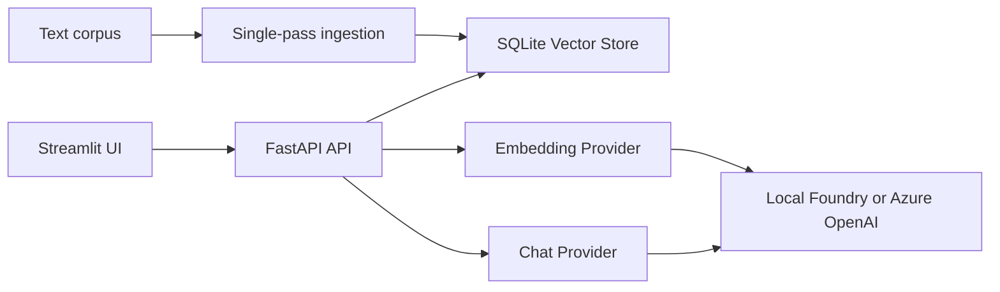

# Foundry RAG Cloud

Production-oriented hybrid retrieval augmented generation service with an offline Local Foundry mode and Azure OpenAI mode.

## Architecture



The FastAPI service owns the HTTP contract, authentication, health/readiness, ingestion, and query orchestration. SQLite stores normalized JSON embeddings and index metadata. The Streamlit process is a separate Compose service and waits for API readiness.

## Configuration

Copy `.env.example` to `.env` and replace all secret placeholders. `API_KEY` must be a long random value in deployments. Use `RAG_MODE=LOCAL` for offline Local Foundry or `RAG_MODE=AZURE_CLOUD` with Azure endpoint and key settings. `DB_PATH` is mapped to `RAG_DATABASE_PATH` by Compose and defaults to the persistent `/app/data/rag.db` path.

## Local Foundry, offline

1. Create a Python 3.13 environment: `python3.13 -m venv .venv`.
2. Install dependencies: `.venv/bin/pip install -r requirements.txt`.
3. Set `RAG_MODE=LOCAL`, `FOUNDRY_MODEL_PATH`, and the local model names in `.env` or the shell.
4. Index the corpus: `.venv/bin/python main.py ingest`.
5. Query it: `.venv/bin/python main.py query "What is in the corpus?"`.
6. Start the API: `.venv/bin/uvicorn api:app --host 127.0.0.1 --port 8000`.

## Azure OpenAI

Set `RAG_MODE=AZURE_CLOUD`, `AZURE_OPENAI_ENDPOINT`, `AZURE_OPENAI_API_KEY`, deployment names, and `AZURE_EMBEDDING_DIMENSION`. Keep the key in an environment secret manager and never commit `.env`. Then run `python main.py ingest` and start Uvicorn as above.

## Docker Compose

Requires Docker Engine with Compose v2.

```sh
cp .env.example .env
# Edit .env and set API_KEY and the selected provider settings.
docker compose config
docker compose up --build
```

The API is available on `http://localhost:8000`, Streamlit on `http://localhost:8501`, and SQLite data persists in the `foundry-rag-data` named volume. The container runs as UID 10001. The root filesystem is read-only and only `/app/data` is writable.

## CLI and evaluation

Ingestion and interactive commands are available through `main.py`:

```sh
python main.py ingest
python main.py query "your question"
python main.py chat
```

Benchmark datasets are JSON lists (or `{ "cases": [...] }`) with this shape:

```json
[
  {
    "question": "Which service stores embeddings?",
    "relevant_sources": ["doc1"],
    "answer_terms": ["SQLite"]
  }
]
```

Run a reproducible evaluation and write a report:

```sh
python evaluate.py --dataset test_data.json --output eval_report.json --mode LOCAL
```

The report includes Precision@3, MRR, citation grounding/faithfulness, per-case latency, and average latency. The legacy bundled-question evaluation remains available through `python main.py eval --output evaluation.json`.

Export the API contract for gateways or SDK generation:

```sh
python export_openapi.py --output openapi.json
```

## Security and reliability

- API key checks use the same `bool(settings.api_key and settings.api_key.strip())` configuration rule in middleware and route dependencies. Middleware rejects protected requests with 401 before FastAPI body validation, and comparison uses `secrets.compare_digest`.
- Ingestion reads each file once into an immutable snapshot. The corpus digest uses length-prefixed framing in the form `len:name:len:content:` so filename/content boundaries cannot be ambiguously concatenated. Chunks retain source text and character offsets from that snapshot.
- SQLite writes use an RLock, WAL mode, a busy timeout, and atomic replacement transactions. Health readiness verifies schema presence, metadata JSON, configured dimension, exact chunk count, and the first stored embedding's decoding and dimension.
- Search uses a `LEFT JOIN` for provenance. Legacy or unmapped chunks return `source_file`, `character_offset`, and `corpus_hash` as `null` rather than failing.
- The Streamlit app keeps chat history in per-session state and bounds it to 30 messages. Provider and filesystem errors are replaced with stable user-facing messages.

## CI/CD

`.github/workflows/ci.yml` runs Python 3.13 compilation, Ruff, Flake8, MyPy, the full pytest suite with an 85% coverage gate over the API/config contract modules, Bandit, pip-audit, and a non-root container health validation. Deployment hardening and cloud runner configuration remain environment-specific release work.

## Performance and benchmark reporting

Evaluation reports provide retrieval quality and latency baselines for each dataset. Run the same dataset, provider mode, model deployment, and corpus snapshot when comparing changes. Record P@3, MRR, grounding rate, average latency, and per-case latency in release notes or the deployment system.
