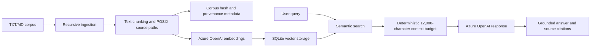
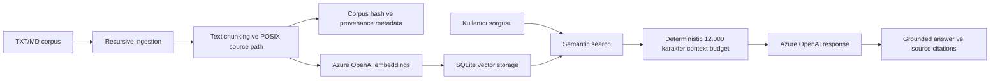

# Foundry RAG Cloud

[](https://ceren-azure-ai.streamlit.app)
[](https://github.com/omrumcerenguler/foundry-rag-cloud/actions/workflows/ci.yml)

> Production-oriented hybrid RAG assistant with Azure OpenAI, SQLite vector persistence, a FastAPI service boundary, and a Streamlit interface.

**Live demo:** [ceren-azure-ai.streamlit.app](https://ceren-azure-ai.streamlit.app)

## English

### Technical Profile

| Layer | Implementation |
| --- | --- |
| Generative model | Azure OpenAI `gpt-4.1-mini` deployment |
| Embeddings | Azure OpenAI `text-embedding-3-small` deployment |
| Vector persistence | SQLite BLOB-backed store with cosine similarity |
| Service API | FastAPI with Pydantic contracts, API-key protection, health/readiness endpoints, and opt-in CORS |
| User interface | Streamlit chat UI with session history, source inspection, ingestion control, and latency display |
| Runtime | Python 3.13 slim containers, non-root UID/GID 10001 |
| Delivery | Docker, Docker Compose, GitHub Actions CI/CD |

### Architecture and Data Flow



The ingestion pipeline recursively discovers readable `.txt` and `.md` files, ignores hidden files and symlinks, reads each file once, and assigns POSIX relative source identifiers such as `guides/setup.md`. The chunker preserves character offsets, source identifiers, and a deterministic corpus hash. Embeddings and metadata are replaced atomically in SQLite. Query execution performs cosine similarity search, applies a confidence threshold, injects only bounded retrieved context, and rejects uncited model output with a safe fallback.

The application supports two deployment modes:

- **Direct mode:** Streamlit calls the configured provider and local SQLite store in the same process.
- **API mode:** Set `RAG_API_URL`; Streamlit calls the FastAPI service, which owns provider access, ingestion, authentication, health, and query orchestration.

### Enterprise Hardening and Engineering Highlights

- **Azure API resilience:** 429 responses honor bounded `Retry-After` values and retry with exponential backoff. Transient 5xx responses receive up to three total attempts with exponential backoff. The current implementation does not add random jitter; jitter is a future tuning option for high-concurrency deployments.
- **Context budgeting:** Retrieved context is deterministically capped at 12,000 characters before prompt injection. This bounds prompt growth, reduces accidental context-window exhaustion, and controls avoidable token spend.
- **Filesystem safety:** Parent directories for custom file-backed SQLite paths are created automatically. `:memory:` remains supported without filesystem operations.
- **Recursive ingestion:** Nested text files are indexed with POSIX relative source identifiers, preventing collisions between files with the same basename in different directories.
- **Container security:** The multi-stage API image and standalone Streamlit image run as least-privilege `appuser:appgroup` with UID/GID 10001. The API image uses the standalone `healthcheck.py` readiness probe.
- **Failure isolation:** Unreadable, invalid UTF-8, binary-looking, or symlinked documents are skipped; failed embedding or persistence operations preserve the previous index through atomic replacement semantics.
- **Code quality and security:** The repository has 69 automated tests, an 85% CI coverage gate, strict MyPy checking, Ruff, Flake8, Bandit, and dependency scanning with `pip-audit`.

### Getting Started

#### Local setup

Requirements: Python 3.13 and a configured Azure OpenAI resource, or the optional Foundry Local runtime for offline mode.

```sh
git clone git@github.com:omrumcerenguler/foundry-rag-cloud.git
cd foundry-rag-cloud
python3.13 -m venv .venv
.venv/bin/python -m pip install -r requirements.txt
cp .env.example .env
```

For Azure mode, set the following values in `.env` or in your secret manager:

```dotenv
RAG_MODE=AZURE_CLOUD
AZURE_OPENAI_ENDPOINT=https://your-resource.openai.azure.com/
AZURE_OPENAI_API_KEY=replace-with-secret
AZURE_OPENAI_API_VERSION=2024-10-21
AZURE_EMBEDDING_DEPLOYMENT=text-embedding-3-small
AZURE_CHAT_DEPLOYMENT=gpt-4.1-mini
AZURE_EMBEDDING_DIMENSION=1536
RAG_CONFIDENCE_THRESHOLD=0.35
RAG_DATABASE_PATH=stores/rag.db
```

Index the bundled corpus and start the API:

```sh
PYTHONPATH=. .venv/bin/python main.py ingest
PYTHONPATH=. .venv/bin/uvicorn api:app --host 127.0.0.1 --port 8000
```

Run the Streamlit UI directly in another terminal:

```sh
PYTHONPATH=. .venv/bin/streamlit run app.py
```

To use a separate API process, set `RAG_API_URL=http://127.0.0.1:8000` and provide the matching `API_KEY`.

#### Docker Compose

Docker Engine with Compose v2 is required.

```sh
cp .env.example .env
# Edit .env and set API_KEY plus Azure or Local Foundry settings.
docker compose config
docker compose up --build
```

The API listens on `http://localhost:8000` and Streamlit on `http://localhost:8501`. The named `foundry-rag-data` volume persists SQLite data. The API and UI containers use a read-only root filesystem; only `/app/data` is writable. After startup, index the corpus with an authenticated request:

```sh
curl -X POST http://localhost:8000/ingest -H "X-API-Key: $API_KEY"
```

`Dockerfile` builds the FastAPI API image. `Dockerfile.streamlit` builds a standalone Streamlit image. Compose currently uses `Dockerfile` for both services and overrides the UI service command with Streamlit.

#### Evaluation and API contract

The checked-in evaluation dataset contains answerable ground-truth cases:

```sh
PYTHONPATH=. .venv/bin/python evaluate.py --dataset data/eval_dataset.json --output eval_report.json --mode AZURE_CLOUD
```

The report records Precision@3, MRR, citation grounding, per-case latency, and average latency. The bundled `questions/questions.txt` mode remains available through `evaluate.py` without `--dataset`. Export the FastAPI contract with:

```sh
PYTHONPATH=. .venv/bin/python export_openapi.py --output openapi.json
```

The CLI also supports:

```sh
PYTHONPATH=. .venv/bin/python main.py query "What are the three phases of the project plan?"
PYTHONPATH=. .venv/bin/python main.py health
PYTHONPATH=. .venv/bin/python main.py chat
```

### Configuration Reference

| Variable | Required | Purpose |
| --- | --- | --- |
| `RAG_MODE` | Yes | `LOCAL` or `AZURE_CLOUD` |
| `AZURE_OPENAI_ENDPOINT` | Azure | Azure resource base URL |
| `AZURE_OPENAI_API_KEY` | Azure | Azure credential; never commit it |
| `AZURE_OPENAI_API_VERSION` | No | Defaults to `2024-10-21` |
| `AZURE_EMBEDDING_DEPLOYMENT` | No | Defaults to `text-embedding-3-small` |
| `AZURE_CHAT_DEPLOYMENT` | No | Defaults to `gpt-4.1-mini` |
| `AZURE_EMBEDDING_DIMENSION` | No | Defaults to `1536` |
| `RAG_DATABASE_PATH` | No | File-backed SQLite path |
| `RAG_CONFIDENCE_THRESHOLD` | No | Similarity cutoff, default `0.35` |
| `RAG_DATA_DIR` | No | Ingestion directory, default `data` |
| `API_KEY` | API mode | Protects `/query`, `/ingest`, and `/metadata` |
| `RAG_API_URL` | API mode | Makes Streamlit call FastAPI instead of direct mode |
| `CORS_ALLOWED_ORIGINS` | No | Comma-separated allowlist; empty means disabled |

Streamlit Community Cloud uses `app.py` as the **Main file path**. Paste flat TOML keys into its Secrets field; `config.py` bridges scalar `st.secrets` values into the environment settings. Cloud filesystem storage is ephemeral, so persistent production indexes should use the API deployment and its named volume or an external store.

### CI/CD and Quality Gates

[`.github/workflows/ci.yml`](.github/workflows/ci.yml) runs on pushes and pull requests with Python 3.13:

1. Compile, Ruff, Flake8, and strict MyPy checks.
2. 69-test pytest suite with an 85% coverage gate and deterministic mock Azure settings.
3. Bandit and `pip-audit` security checks.
4. Docker build, non-root UID validation, and API healthcheck validation.

The repository also includes `.devcontainer/devcontainer.json` for a Python 3.13 development container, `.gitattributes` for LF line endings, and an MIT `LICENSE`.

## Türkçe

### Teknik Profil ve Stack

| Katman | Uygulama |
| --- | --- |
| Üretken model | Azure OpenAI `gpt-4.1-mini` deployment |
| Embedding | Azure OpenAI `text-embedding-3-small` deployment |
| Vektör kalıcılığı | Cosine similarity hesaplayan SQLite BLOB store |
| Servis API'si | Pydantic sözleşmeleri, API-key koruması, health/readiness endpoint'leri ve opt-in CORS kullanan FastAPI |
| Kullanıcı arayüzü | Session history, kaynak inceleme, ingestion kontrolü ve latency görünümü olan Streamlit chat UI |
| Runtime | Python 3.13 slim container'ları, root olmayan UID/GID 10001 |
| Teslimat | Docker, Docker Compose ve GitHub Actions CI/CD |

**Canlı demo:** [ceren-azure-ai.streamlit.app](https://ceren-azure-ai.streamlit.app)

### Mimari ve Veri Akışı



Ingestion pipeline, okunabilir `.txt` ve `.md` dosyalarını recursive olarak keşfeder; gizli dosyaları ve symlink'leri atlar, her dosyayı bir kez okur ve `guides/setup.md` gibi POSIX relative source identifier üretir. Chunker, karakter offset'lerini, source identifier'larını ve deterministic corpus hash değerini korur. Embedding'ler ve metadata SQLite'a atomic olarak yazılır. Sorgu akışı cosine similarity araması yapar, confidence threshold uygular, yalnızca sınırlandırılmış retrieved context'i prompt'a ekler ve citation üretmeyen model cevabını güvenli fallback ile reddeder.

Uygulamanın iki çalışma modu vardır:

- **Direct mode:** Streamlit provider'a ve SQLite store'a aynı process içinden erişir.
- **API mode:** `RAG_API_URL` ayarlandığında Streamlit FastAPI servisini çağırır. Provider erişimi, ingestion, authentication, health ve query orchestration FastAPI tarafından yönetilir.

### Enterprise Hardening ve Mühendislik Öne Çıkanları

- **Azure API dayanıklılığı:** 429 cevaplarında sınırlandırılmış `Retry-After` değeri dikkate alınır ve exponential backoff uygulanır. Geçici 5xx cevaplarında en fazla üç toplam deneme ve exponential backoff vardır. Mevcut implementation rastgele jitter eklemez; yüksek concurrency ortamları için gelecekte eklenebilir.
- **Context budgeting:** Retrieved context, prompt'a eklenmeden önce deterministic olarak 12.000 karakter ile sınırlandırılır. Bu yaklaşım context-window tükenmesini ve gereksiz token maliyetini azaltır.
- **Filesystem safety:** Custom file-backed SQLite path'lerinin eksik parent dizinleri otomatik oluşturulur. `:memory:` kullanımı filesystem işlemi yapılmadan korunur.
- **Recursive ingestion:** Nested text dosyaları POSIX relative source identifier ile index'lenir; farklı dizinlerdeki aynı dosya adlarının çakışması önlenir.
- **Container security:** Multi-stage API image ve standalone Streamlit image, UID/GID 10001 kullanan least-privilege `appuser:appgroup` olarak çalışır. API image, bağımsız `healthcheck.py` readiness probe kullanır.
- **Failure isolation:** Okunamayan, geçersiz UTF-8 içeren, binary görünen veya symlink olan dosyalar atlanır. Embedding ya da persistence hatasında atomic replacement sayesinde eski index korunur.
- **Code quality ve security:** Repository'de 69 automated test, `%85` CI coverage gate'i, strict MyPy, Ruff, Flake8, Bandit ve `pip-audit` dependency taraması vardır.

### Kurulum ve Tekrarlanabilirlik

#### Local kurulum

Gereksinimler: Python 3.13 ve yapılandırılmış Azure OpenAI resource'u veya offline mod için opsiyonel Foundry Local runtime.

```sh
git clone git@github.com:omrumcerenguler/foundry-rag-cloud.git
cd foundry-rag-cloud
python3.13 -m venv .venv
.venv/bin/python -m pip install -r requirements.txt
cp .env.example .env
```

Azure modu için `.env` veya secret manager içinde endpoint, key, deployment isimleri, API version ve embedding dimension değerlerini ayarlayın. Ardından:

```sh
PYTHONPATH=. .venv/bin/python main.py ingest
PYTHONPATH=. .venv/bin/uvicorn api:app --host 127.0.0.1 --port 8000
PYTHONPATH=. .venv/bin/streamlit run app.py
```

Streamlit Community Cloud için **Main file path** değeri `app.py` olmalıdır. Secrets alanında düz TOML anahtarları kullanın; `config.py`, scalar `st.secrets` değerlerini `Settings.from_env()` tarafından okunabilen environment değişkenlerine bağlar.

#### Docker ve Docker Compose

```sh
cp .env.example .env
# API_KEY ve seçilen provider ayarlarını düzenleyin.
docker compose config
docker compose up --build
```

API `http://localhost:8000`, Streamlit `http://localhost:8501` üzerinden çalışır. `foundry-rag-data` named volume SQLite verisini korur. Root filesystem read-only'dir; yalnızca `/app/data` yazılabilir. İlk kurulumdan sonra corpus'u şu istekle index'leyin:

```sh
curl -X POST http://localhost:8000/ingest -H "X-API-Key: $API_KEY"
```

`Dockerfile` FastAPI image'ını, `Dockerfile.streamlit` standalone Streamlit image'ını üretir. Compose şu anda her iki servis için ana `Dockerfile`ı kullanır ve UI command'ini Streamlit olarak override eder.

#### Evaluation ve API contract

Ground-truth evaluation dataset'i hazırdır:

```sh
PYTHONPATH=. .venv/bin/python evaluate.py --dataset data/eval_dataset.json --output eval_report.json --mode AZURE_CLOUD
```

Rapor Precision@3, MRR, citation grounding, vaka bazlı latency ve ortalama latency metriklerini içerir. API sözleşmesini üretmek için:

```sh
PYTHONPATH=. .venv/bin/python export_openapi.py --output openapi.json
```

### Konfigürasyon Özeti

Azure pipeline için zorunlu temel değerler:

```text
RAG_MODE=AZURE_CLOUD
AZURE_OPENAI_ENDPOINT=https://your-resource.openai.azure.com/
AZURE_OPENAI_API_KEY=replace-with-secret
```

API version, deployment isimleri, embedding dimension, database path ve confidence threshold için varsayılanlar vardır. `API_KEY` ve `RAG_API_URL` yalnızca UI harici FastAPI backend'e bağlandığında gereklidir. Streamlit Cloud filesystem'i kalıcı değildir; production index için API deployment named volume'u veya harici vector store kullanılmalıdır.

### CI/CD ve Kalite Kapıları

[`.github/workflows/ci.yml`](.github/workflows/ci.yml), push ve pull request olaylarında Python 3.13 ile çalışır:

1. Compile, Ruff, Flake8 ve strict MyPy kontrolleri.
2. Deterministic mock Azure ayarlarıyla 69 test ve `%85` coverage gate'i.
3. Bandit ve `pip-audit` security kontrolleri.
4. Docker build, non-root UID doğrulaması ve API healthcheck testi.

Repository ayrıca Python 3.13 `.devcontainer`, LF line-ending `.gitattributes` ve MIT `LICENSE` içerir.

### Portfolio Özeti

Bu proje yalnızca bir LLM demosu değildir; provider abstraction, provenance-aware ingestion, deterministic context bounds, atomic SQLite replacement, API boundary, container hardening ve CI security gates içeren üretim odaklı bir RAG reference implementation'ıdır.
